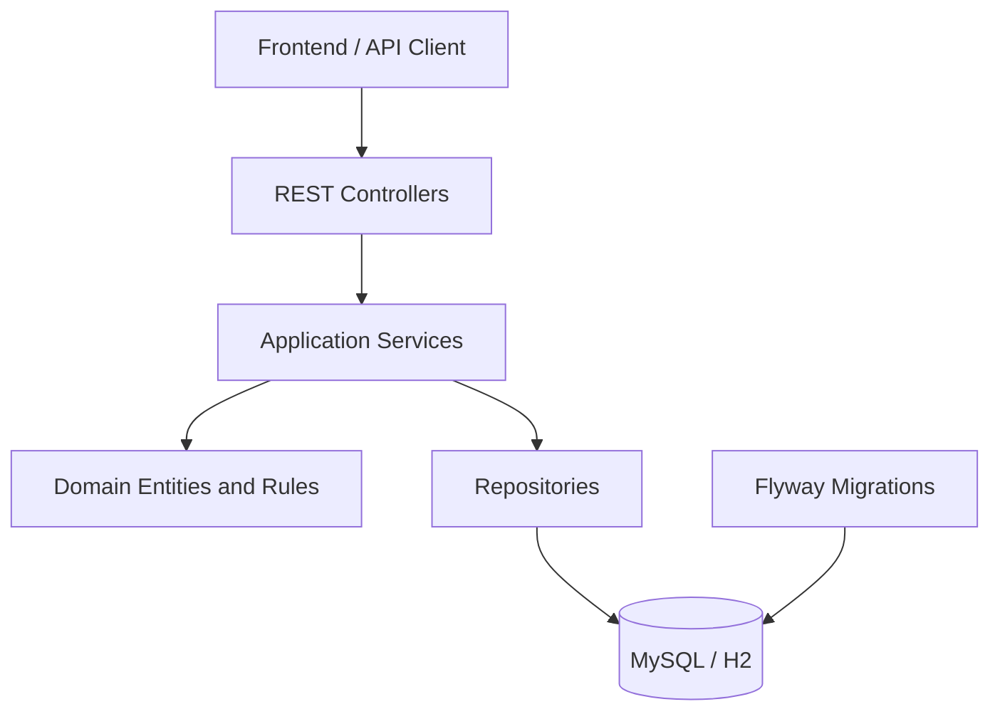
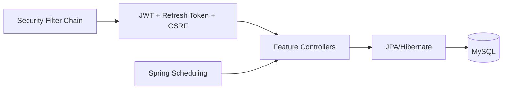
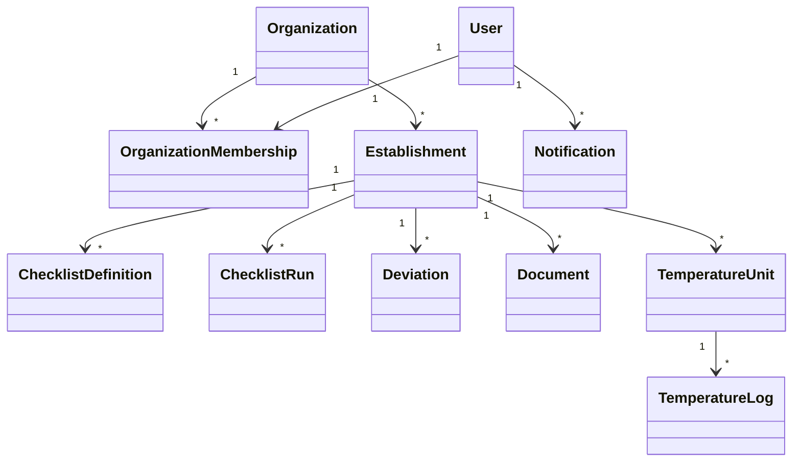

# Backend System Documentation

This document is the backend system-documentation source and is intended to be exported to PDF when needed.

## 1. Module Summary

The backend is a Spring Boot application organized by feature area. Each feature typically owns:

- API/controller classes
- application services
- domain model
- persistence/repository layer

Shared concerns such as security, exception handling, and startup readiness are kept in common packages.

## 2. Package Structure

Main package root:

- [`backend/src/main/java/org/kontrolla/`](../../backend/src/main/java/org/kontrolla/)

Important feature packages:

- `iam`: authentication, user management, invites, refresh tokens
- `organizations`: organizations, memberships, tenant access rules
- `establishments`: establishment records and serving hours
- `checklists`: checklist definitions, schedules, runs, task execution
- `deviations`: issue reporting and follow-up workflow
- `documents`: document metadata, file storage, audit acknowledgement
- `notifications`: user notifications
- `temperatures`: temperature units and logs
- `audit`: audit recording infrastructure
- `common`: shared API and application infrastructure

## 3. High-Level Architecture

## 4. Runtime Architecture

## 5. Tenancy Model

The application is multi-tenant.

- `Organization` is the top-level tenant boundary.
- `Establishment` is the operational scope inside an organization.
- Memberships decide which organizations and establishments a user can access.
- Most business endpoints therefore require both `organizationId` and `establishmentId`.

## 6. Data Model Overview

Core relations:

## 7. Feature Notes

### 7.1 IAM

- JWT access tokens for API calls
- refresh token cookie for session continuation
- CSRF token bootstrap for browser requests
- invite-based onboarding for managed users

### 7.2 Organizations

- central tenant administration
- role-based membership model
- establishment-scoped or organization-wide access

### 7.3 Checklists

- versioned definitions
- schedules generate runs over time
- runs snapshot tasks for audit-safe history
- assignments and events support follow-up and traceability

### 7.4 Documents

- metadata and file storage kept together
- audit assignments track who must acknowledge a document
- status is derived from dates such as `renewalDate`

### 7.5 Deviations

- establishment-scoped issue reporting
- assignment, status changes, and timeline notes
- notification integration for follow-up

### 7.6 Temperature Logging

- establishment-specific temperature units
- repeated log entries with limits and due times

## 8. Persistence And Migrations

Schema management lives in:

- [`backend/src/main/resources/db/migration/`](../../backend/src/main/resources/db/migration/)

Persistence notes:

- JPA/Hibernate handles ORM mapping
- Flyway manages schema evolution
- `dev` and `prod` use MySQL
- `test` uses H2 with separate configuration

## 9. Security And Access Control

Relevant source:

- [`backend/src/main/java/org/kontrolla/iam/security/SecurityConfig.java`](../../backend/src/main/java/org/kontrolla/iam/security/SecurityConfig.java)

Main rules:

- all business endpoints require authentication
- selected auth, Swagger, and health endpoints are public
- method-level security is enabled
- access control is checked both at HTTP level and in services

## 10. Developer Onboarding Notes

For a new backend developer, the shortest useful path is:

1. Start MySQL and backend with Docker Compose.
2. Open Swagger and verify the backend is reachable.
3. Read `iam`, `organizations`, and `establishments` first because they define tenant and auth context.
4. Then read the feature package you plan to change.
5. Run integration tests for the affected feature.
