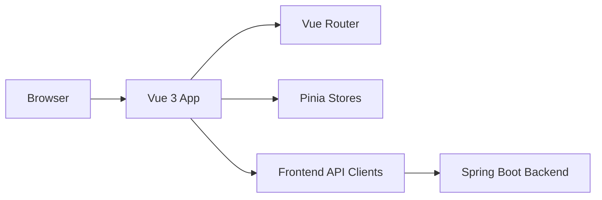

# Frontend System Documentation

This document is the frontend system-documentation source and is intended to be exported to PDF when needed.

## 1. Module Summary

The frontend is a Vue 3 SPA built with Vite and TypeScript. It renders:

- public routes for landing and pricing
- auth routes for login and invite acceptance
- authenticated workspace routes under `/app`
- feature modules for checklists, deviations, documents, temperature logging, notifications, and account management

## 2. High-Level Architecture

## 3. Route Structure

Main route source: [`frontend/src/app/router/routes.ts`](../../frontend/src/app/router/routes.ts)

- `/`: public landing page
- `/price-offer`: public pricing page
- `/login`: login page
- `/invite/:token`: invitation acceptance flow
- `/app`: authenticated workspace shell
- `/app/ik-mat`: IK-Mat dashboard
- `/app/ik-mat/checklists`: checklist management and execution
- `/app/ik-mat/deviation`: deviations in food-control context
- `/app/ik-mat/documents`: document overview
- `/app/ik-mat/documents/upload`: document upload
- `/app/ik-mat/temperature`: temperature logging overview
- `/app/ik-mat/temperature/new`: create temperature unit
- `/app/ik-alkohol`: IK-Alkohol dashboard
- `/app/ik-alkohol/deviation`: deviations in alcohol-control context
- `/app/ik-alkohol/documents`: document overview
- `/app/ik-alkohol/documents/upload`: document upload
- `/app/ik-alkohol/serving-hours`: serving-hours editor
- `/app/my-profile`: user profile
- `/app/settings`: user settings
- `/app/organization/members`: organization member management
- `/app/notifications`: notifications overview

## 4. Frontend Module Breakdown

### 4.1 `app`

- Layouts, top-level shell, router, auth guards, startup-state handling.
- Key files:
  - [`frontend/src/app/router/routes.ts`](../../frontend/src/app/router/routes.ts)
  - [`frontend/src/app/layouts/AppLayout.vue`](../../frontend/src/app/layouts/AppLayout.vue)
  - [`frontend/src/app/api/startup.api.ts`](../../frontend/src/app/api/startup.api.ts)

### 4.2 `auth`

- Login flow, invite acceptance, auth store, session refresh integration.
- Depends on backend auth, CSRF, and invite endpoints.

### 4.3 `workspace`

- Builds workspace dashboard summaries and shared authenticated landing flow.

### 4.4 `ik-mat`

- Dashboard, temperature logging, and checklists relevant to food safety.

### 4.5 `ik-alkohol`

- Dashboard and serving-hours/document/deviation flows relevant to alcohol compliance.

### 4.6 Shared business modules

- `checklists`: checklist definitions and checklist run execution
- `documents`: document upload, listing, download, and read acknowledgement
- `deviations`: reporting and follow-up of deviations
- `notifications`: notification list and read state
- `account`: profile and organization membership management
- `establishments`: establishment and serving-hours API integration
- `organizations`: admin organization listing
- `shared`: HTTP client, CSRF helper, base UI components, environment config

## 5. Frontend-Backend Integration

API base URL construction:

- [`frontend/src/shared/config/env.ts`](../../frontend/src/shared/config/env.ts)
- [`frontend/src/shared/config/api.ts`](../../frontend/src/shared/config/api.ts)

HTTP and CSRF handling:

- [`frontend/src/shared/api/http.ts`](../../frontend/src/shared/api/http.ts)
- [`frontend/src/shared/api/csrf.ts`](../../frontend/src/shared/api/csrf.ts)

Important integration rules:

- authenticated requests use bearer access tokens
- state-changing requests also include CSRF headers
- refresh token handling depends on backend cookies
- organization and establishment context are required for most business endpoints

## 6. Frontend API Client Surface

The frontend calls these backend areas:

- `system`: startup readiness
- `auth`: login, refresh, logout, invite handling, profile
- `organizations`: admin organization listing
- `memberships`: organization membership listing and management
- `establishments`: establishment list and serving hours
- `checklists`: definitions and runs
- `deviations`: create, list, update, assign, timeline
- `documents`: list, upload, update, delete, download, acknowledge
- `notifications`: list and read state
- `temperature-units`: create/list/delete units and create temperature logs

Representative client files:

- [`frontend/src/auth/api/auth.api.ts`](../../frontend/src/auth/api/auth.api.ts)
- [`frontend/src/checklists/api/checklist-definitions.api.ts`](../../frontend/src/checklists/api/checklist-definitions.api.ts)
- [`frontend/src/checklists/api/checklist-runs.api.ts`](../../frontend/src/checklists/api/checklist-runs.api.ts)
- [`frontend/src/deviations/api/deviations.api.ts`](../../frontend/src/deviations/api/deviations.api.ts)
- [`frontend/src/documents/api/documents.api.ts`](../../frontend/src/documents/api/documents.api.ts)
- [`frontend/src/ik-mat/api/temperature.api.ts`](../../frontend/src/ik-mat/api/temperature.api.ts)

## 7. Developer Onboarding Notes

For a new frontend developer, the shortest useful path is:

1. Start backend and frontend with Docker Compose.
2. Log in with a dev user from [`test-data.md`](./test-data.md).
3. Read the route tree and app shell first.
4. Read the API client for the feature being changed.
5. Read the corresponding page and component files for that feature.

## 8. Code Documentation Requirement

The frontend mainly uses TypeScript typing and self-describing module boundaries rather than Javadoc-style documentation. Backend classes and REST API classes contain Javadoc where required by the course requirement. Frontend documentation responsibility is fulfilled primarily through:

- strongly typed models and API clients
- module-level documentation in this folder
- route and architecture documentation in this document
